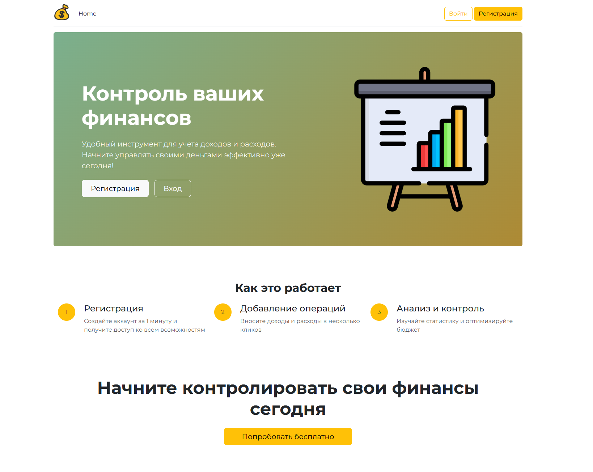
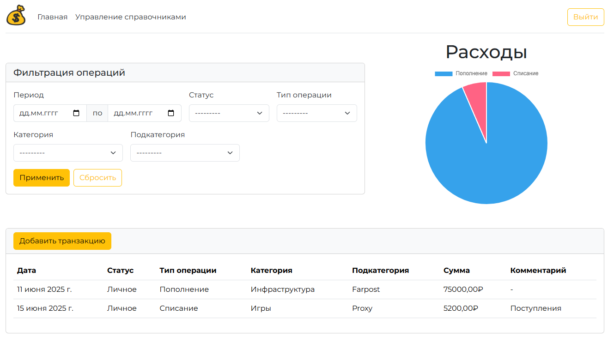
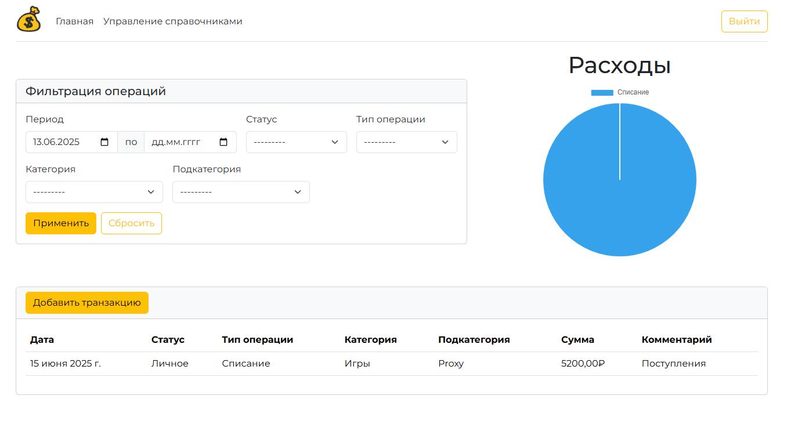
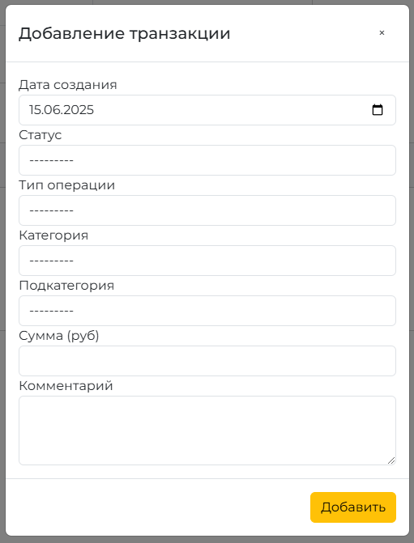
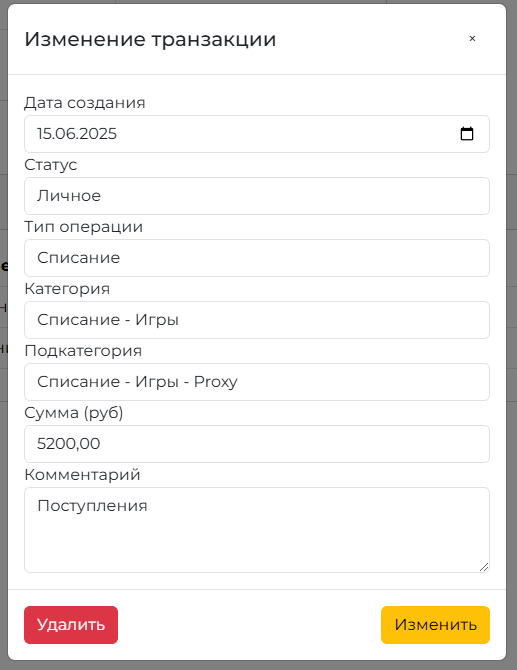
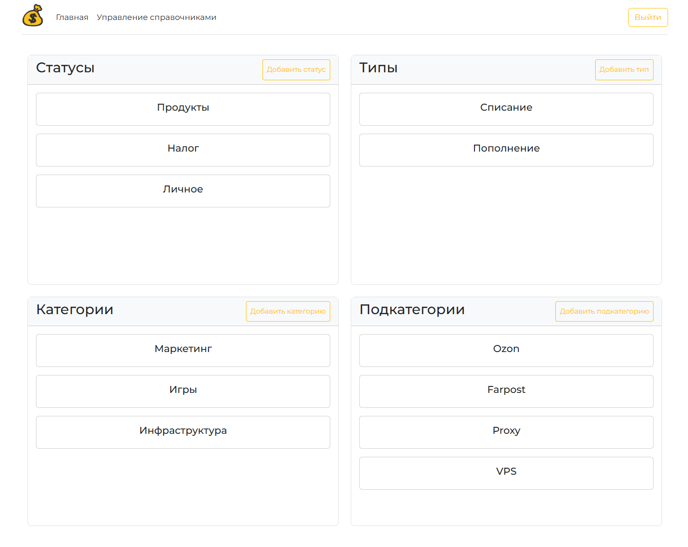
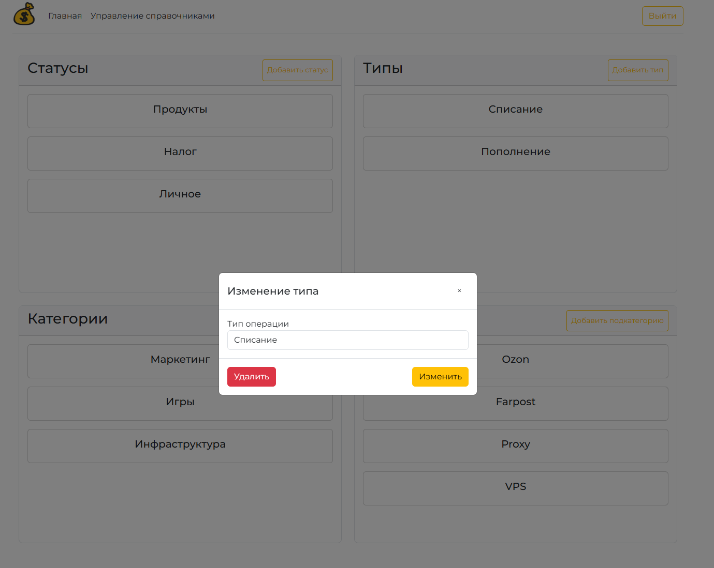

# Веб-приложения движения денежных средств


## Запуск

Проект сделан на Sqlite, поэтому запускается без настройки бд

```bash
  git clone https://github.com/NikUvolen/tech-task
  cd tech-task
  python -m venv venv
  . ./venv/bin/activate
  pip install -r requirements.txt
  python CashFlow/manage.py migrate
  python CashFlow/manage.py runserver
```

## Скрины















