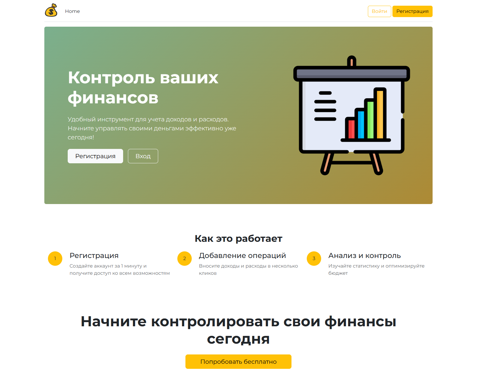
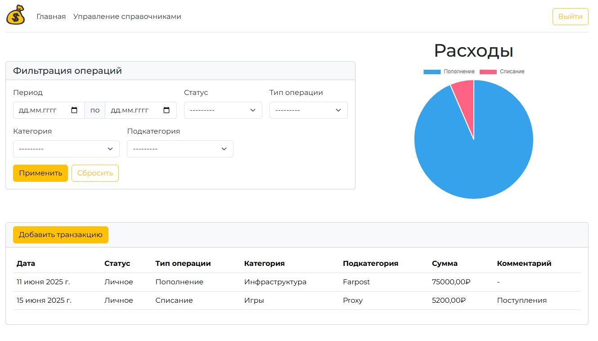
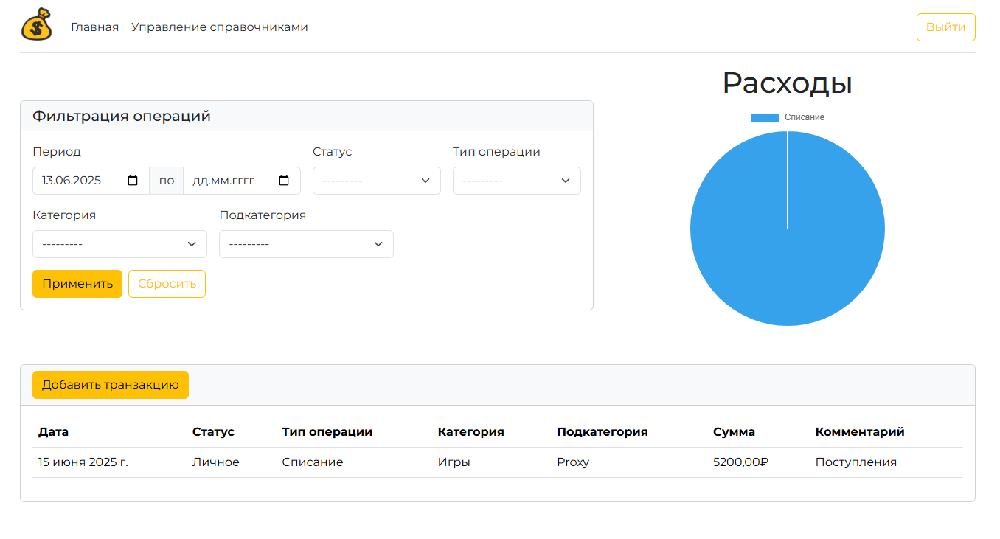
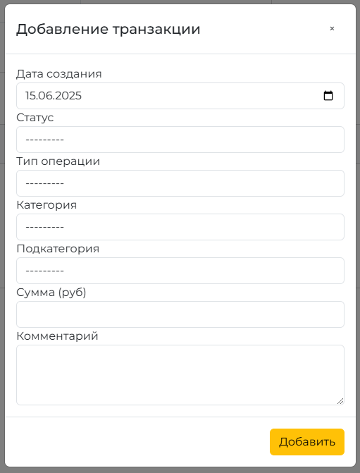
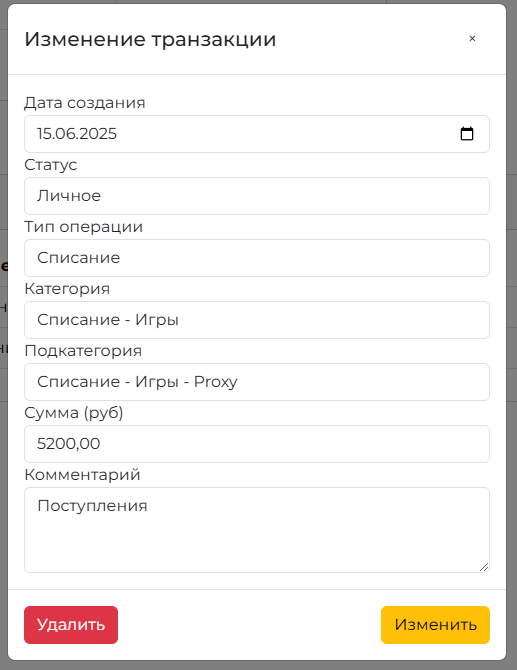
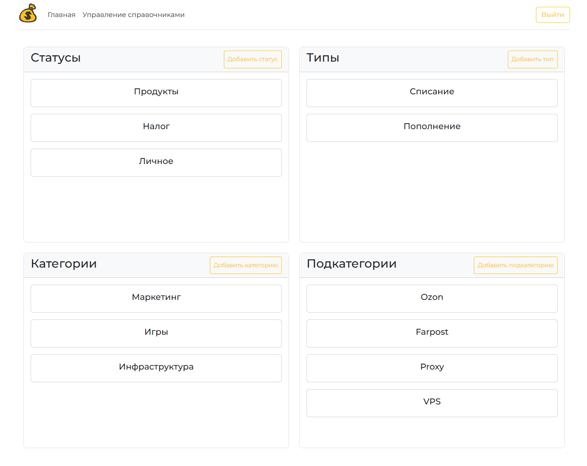
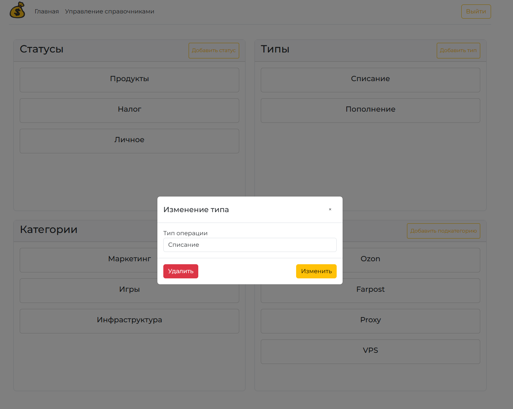
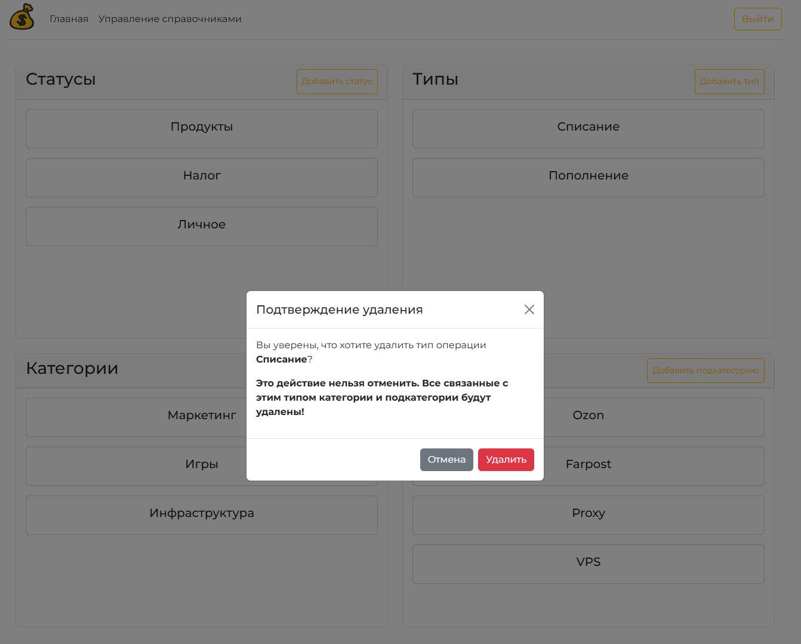

# Веб-приложение движения денежных средств


## Запуск

Проект сделан на Sqlite, поэтому запускается без настройки бд

```bash
  git clone https://github.com/NikUvolen/tech-task
  cd tech-task
  uv sync
  uv run python CashFlow/manage.py migrate
  uv run python CashFlow/manage.py runserver
```

## Запуск через Docker

Поднимает Django, PostgreSQL и Nginx в отдельных контейнерах.

```bash
docker compose up --build
```

После старта приложение будет доступно на `http://localhost:8000`, база данных на `localhost:5432`.

## Скрины
















